# Tabla de kana

Todas las respuestas que acepta la app, con su mnemotecnia y la imagen que
muestra. El **id** es el nombre del archivo en `images/pista/` y
`images/resultado/`.

> Este archivo se **regenera automáticamente** desde `kana.json` cada vez que
> editás una mnemotecnia desde la app. No lo edites a mano: editá `kana.json`
> y corré `python3 kana_tray.py --tabla`.

## Hiragana

### Básicos

| Kana | Romaji | También vale | Imagen | Mnemotecnia | id |
|:---:|:---:|:---:|:---:|---|---|
| **あ** | a | — | 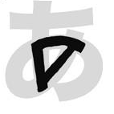 | Buscá la 'A' mayúscula escondida dentro de あ. | `h_a` |
| **い** | i | — | 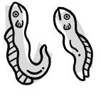 | Un par de anguilas (EEls → 'i') una al lado de la otra. | `h_i` |
| **う** | u | — | 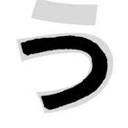 | Buscá la 'U' acostada escondida dentro de う. | `h_u` |
| **え** | e | — | 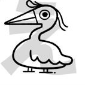 | Un pájaro exótico (Exotic bird → 'e') poniendo huevos. | `h_e` |
| **お** | o | — | 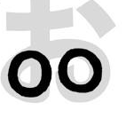 | Dos letras 'o' juntas: el trazo de la derecha y el rulito de abajo. | `h_o` |
| **か** | ka | — | 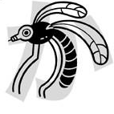 | 'Ka' significa 'mosquito' en japonés: un mosquito con su aguijón. | `h_ka` |
| **き** | ki | — | 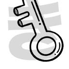 | Una llave (KEY → 'ki'). | `h_ki` |
| **く** | ku | — | 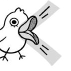 | La boca de un pájaro cucú diciendo '¡KU-ku!'. | `h_ku` |
| **け** | ke | — | 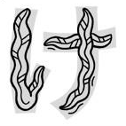 | Algas marinas que se retuercen (KElp → 'ke'). | `h_ke` |
| **こ** | ko | — | 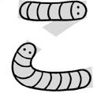 | Dos gusanitos conviviendo, uno arriba del otro (CO-habitación → 'ko'). | `h_ko` |
| **さ** | sa | — | 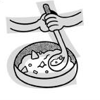 | Un cucharón revolviendo una SAlsa bien espesa → 'sa'. | `h_sa` |
| **し** | shi | si | 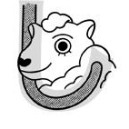 | El cayado de un pastor para arriar ovejas (SHEEp → 'shi'). | `h_shi` |
| **す** | su | — | 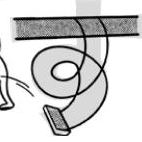 | Un columpio que da un rulo y SUelta al pobre chico que estaba sentado → 'su'. | `h_su` |
| **せ** | se | — | 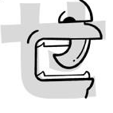 | Una dentadura de vampiro con colmillos (un SEt de dientes → 'se'). | `h_se` |
| **そ** | so | — | 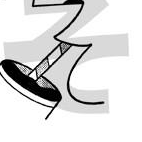 | Una boca sorbiendo SOda con una pajita → 'so'. | `h_so` |
| **た** | ta | — | 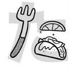 | Un TAco que comés con tenedor: la 't' es el tenedor y la 'a' el taco. | `h_ta` |
| **ち** | chi | ti | 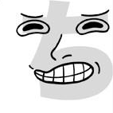 | 'Say CHEEse!': la sonrisa forzada que ponés para la foto → 'chi'. | `h_chi` |
| **つ** | tsu | tu | 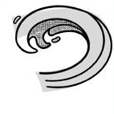 | Una ola gigante como un TSUnami → 'tsu'. | `h_tsu` |
| **て** | te | — | 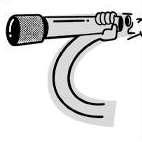 | Un TElescopio de mano → 'te'. | `h_te` |
| **と** | to | — | 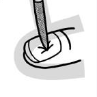 | Un dedo del pie (TOe → 'to') con una astilla clavada. | `h_to` |
| **な** | na | — | 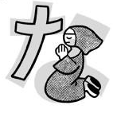 | Una monja rezando frente a la cruz, pidiendo NAchos → 'na'. | `h_na` |
| **に** | ni | — | 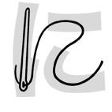 | Una aguja (NEEdle → 'ni') tirando de un hilo. | `h_ni` |
| **ぬ** | nu | — | 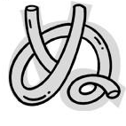 | Unos fideos (NOOdles → 'nu') enredados. | `h_nu` |
| **ね** | ne | — | 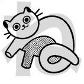 | Nelly, la NEko (gato en japonés) → 'ne'. | `h_ne` |
| **の** | no | — | 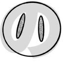 | La nariz de un chancho (NOse → 'no'). | `h_no` |
| **は** | ha | — | 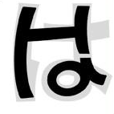 | は parece una 'H' + una 'a' → 'ha'. | `h_ha` |
| **ひ** | hi | — | 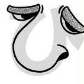 | Él (HE → 'hi') tiene una nariz enorme: una cara de perfil sonriendo. | `h_hi` |
| **ふ** | fu | hu | 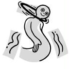 | Un bufón (FOOl → 'fu') bailando con el hula-hula. | `h_fu` |
| **へ** | he | — | 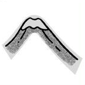 | La famosa montaña: el monte Santa HElena → 'he'. | `h_he` |
| **ほ** | ho | — | 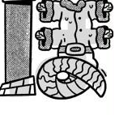 | Un Papá Noel mutante diciendo '¡HO ho ho!' → 'ho'. | `h_ho` |
| **ま** | ma | — | 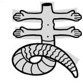 | Imaginate a tu MAmá con esta pinta. ¡Aghh! → 'ma'. | `h_ma` |
| **み** | mi | — | 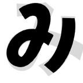 | ¿Quién cumplió 21? ¡Yo! (ME → 'mi'). み parece un 21. | `h_mi` |
| **む** | mu | — | 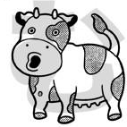 | '¡MUuuu!', dice la vaca → 'mu'. | `h_mu` |
| **め** | me | — | 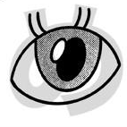 | 'Me' significa 'ojo' en japonés: un ojo grande. | `h_me` |
| **も** | mo | — | 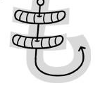 | Para pescar MÁS (MOre → 'mo') peces, poné más gusanos en el anzuelo. | `h_mo` |
| **や** | ya | — |  | Un yate (YAcht → 'ya') con su ancla. | `h_ya` |
| **ゆ** | yu | — | 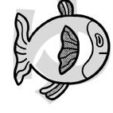 | Un pez rarísimo (Unique fish → 'yu'). | `h_yu` |
| **よ** | yo | — | 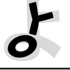 | ¡YO! Buscá la 'y' y la 'o' dentro de よ. | `h_yo` |
| **ら** | ra | — | 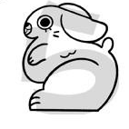 | Un conejo (RAbbit → 'ra'). | `h_ra` |
| **り** | ri | — | 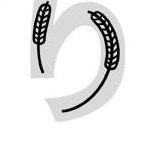 | Juncos (REEds → 'ri') meciéndose con el viento. | `h_ri` |
| **る** | ru | — | 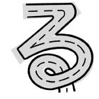 | る es un camino (ROUte → 'ru') más loco: termina en un rulo. | `h_ru` |
| **れ** | re | — | 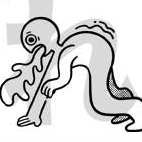 | Este tipo está vomitando (REtching → 're') la cena. | `h_re` |
| **ろ** | ro | — | 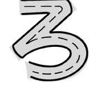 | Un camino común (ROad → 'ro'), sobre todo comparado con る (que tiene rulo). | `h_ro` |
| **わ** | wa | — |  | Una avispa (WAsp → 'wa') volando derecho hacia arriba. | `h_wa` |
| **を** | wo | o | 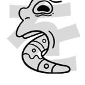 | ¡WHOA! Tiene un búmeran en la boca → 'wo' (suena 'o'). | `h_wo` |
| **ん** | n | nn | 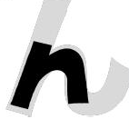 | ん es igualita a una 'n' minúscula. | `h_n` |

### Dakuten / handakuten (゛ ゜)

| Kana | Romaji | También vale | Imagen | Mnemotecnia | id |
|:---:|:---:|:---:|:---:|---|---|
| **が** | ga | — | 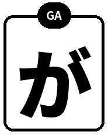 | か (ka) + ゛ (dakuten, dos rayitas): la 'k' se vuelve sonora → ga. | `h_ga` |
| **ぎ** | gi | — | 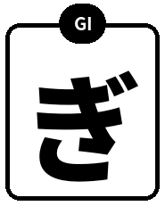 | き (ki) + ゛ (dakuten, dos rayitas): la 'k' se vuelve sonora → gi. | `h_gi` |
| **ぐ** | gu | — | 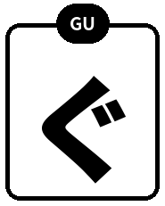 | く (ku) + ゛ (dakuten, dos rayitas): la 'k' se vuelve sonora → gu. | `h_gu` |
| **げ** | ge | — | 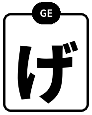 | け (ke) + ゛ (dakuten, dos rayitas): la 'k' se vuelve sonora → ge. | `h_ge` |
| **ご** | go | — | 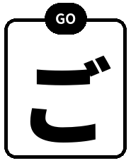 | こ (ko) + ゛ (dakuten, dos rayitas): la 'k' se vuelve sonora → go. | `h_go` |
| **ざ** | za | — | 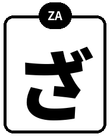 | さ (sa) + ゛ (dakuten, dos rayitas): la 's' se vuelve sonora → za. | `h_za` |
| **じ** | ji | zi |  | し (shi) + ゛ (dakuten, dos rayitas): la 's' se vuelve sonora → ji. | `h_ji` |
| **ず** | zu | — |  | す (su) + ゛ (dakuten, dos rayitas): la 's' se vuelve sonora → zu. | `h_zu` |
| **ぜ** | ze | — |  | せ (se) + ゛ (dakuten, dos rayitas): la 's' se vuelve sonora → ze. | `h_ze` |
| **ぞ** | zo | — |  | そ (so) + ゛ (dakuten, dos rayitas): la 's' se vuelve sonora → zo. | `h_zo` |
| **だ** | da | — |  | た (ta) + ゛ (dakuten, dos rayitas): la 't' se vuelve sonora → da. | `h_da` |
| **ぢ** | ji | di, dji |  | ち (chi) + ゛ (dakuten, dos rayitas): la 'c' se vuelve sonora → ji. Es rara: casi siempre se usa じ/ず. | `h_ji_di` |
| **づ** | zu | du, dzu |  | つ (tsu) + ゛ (dakuten, dos rayitas): la 't' se vuelve sonora → zu. Es rara: casi siempre se usa じ/ず. | `h_zu_du` |
| **で** | de | — |  | て (te) + ゛ (dakuten, dos rayitas): la 't' se vuelve sonora → de. | `h_de` |
| **ど** | do | — |  | と (to) + ゛ (dakuten, dos rayitas): la 't' se vuelve sonora → do. | `h_do` |
| **ば** | ba | — |  | は (ha) + ゛ (dakuten, dos rayitas): la 'h' se vuelve sonora → ba. | `h_ba` |
| **び** | bi | — |  | ひ (hi) + ゛ (dakuten, dos rayitas): la 'h' se vuelve sonora → bi. | `h_bi` |
| **ぶ** | bu | — |  | ふ (fu) + ゛ (dakuten, dos rayitas): la 'f' se vuelve sonora → bu. | `h_bu` |
| **べ** | be | — |  | へ (he) + ゛ (dakuten, dos rayitas): la 'h' se vuelve sonora → be. | `h_be` |
| **ぼ** | bo | — |  | ほ (ho) + ゛ (dakuten, dos rayitas): la 'h' se vuelve sonora → bo. | `h_bo` |
| **ぱ** | pa | — |  | は (ha) + ゜ (handakuten, circulito): la 'h' se vuelve 'p' → pa. | `h_pa` |
| **ぴ** | pi | — |  | ひ (hi) + ゜ (handakuten, circulito): la 'h' se vuelve 'p' → pi. | `h_pi` |
| **ぷ** | pu | — |  | ふ (fu) + ゜ (handakuten, circulito): la 'h' se vuelve 'p' → pu. | `h_pu` |
| **ぺ** | pe | — |  | へ (he) + ゜ (handakuten, circulito): la 'h' se vuelve 'p' → pe. | `h_pe` |
| **ぽ** | po | — |  | ほ (ho) + ゜ (handakuten, circulito): la 'h' se vuelve 'p' → po. | `h_po` |

### Yōon (combinaciones con ゃ ゅ ょ)

| Kana | Romaji | También vale | Imagen | Mnemotecnia | id |
|:---:|:---:|:---:|:---:|---|---|
| **きゃ** | kya | — |  | き (ki) + ゃ chiquita: se funden en una sola sílaba → kya. | `h_kya` |
| **きゅ** | kyu | — |  | き (ki) + ゅ chiquita: se funden en una sola sílaba → kyu. | `h_kyu` |
| **きょ** | kyo | — |  | き (ki) + ょ chiquita: se funden en una sola sílaba → kyo. | `h_kyo` |
| **しゃ** | sha | sya |  | し (shi) + ゃ chiquita: se funden en una sola sílaba → sha. | `h_sha` |
| **しゅ** | shu | syu |  | し (shi) + ゅ chiquita: se funden en una sola sílaba → shu. | `h_shu` |
| **しょ** | sho | syo |  | し (shi) + ょ chiquita: se funden en una sola sílaba → sho. | `h_sho` |
| **ちゃ** | cha | tya, cya |  | ち (chi) + ゃ chiquita: se funden en una sola sílaba → cha. | `h_cha` |
| **ちゅ** | chu | tyu, cyu |  | ち (chi) + ゅ chiquita: se funden en una sola sílaba → chu. | `h_chu` |
| **ちょ** | cho | tyo, cyo |  | ち (chi) + ょ chiquita: se funden en una sola sílaba → cho. | `h_cho` |
| **にゃ** | nya | — |  | に (ni) + ゃ chiquita: se funden en una sola sílaba → nya. | `h_nya` |
| **にゅ** | nyu | — |  | に (ni) + ゅ chiquita: se funden en una sola sílaba → nyu. | `h_nyu` |
| **にょ** | nyo | — |  | に (ni) + ょ chiquita: se funden en una sola sílaba → nyo. | `h_nyo` |
| **ひゃ** | hya | — |  | ひ (hi) + ゃ chiquita: se funden en una sola sílaba → hya. | `h_hya` |
| **ひゅ** | hyu | — |  | ひ (hi) + ゅ chiquita: se funden en una sola sílaba → hyu. | `h_hyu` |
| **ひょ** | hyo | — |  | ひ (hi) + ょ chiquita: se funden en una sola sílaba → hyo. | `h_hyo` |
| **みゃ** | mya | — |  | み (mi) + ゃ chiquita: se funden en una sola sílaba → mya. | `h_mya` |
| **みゅ** | myu | — |  | み (mi) + ゅ chiquita: se funden en una sola sílaba → myu. | `h_myu` |
| **みょ** | myo | — |  | み (mi) + ょ chiquita: se funden en una sola sílaba → myo. | `h_myo` |
| **りゃ** | rya | — |  | り (ri) + ゃ chiquita: se funden en una sola sílaba → rya. | `h_rya` |
| **りゅ** | ryu | — |  | り (ri) + ゅ chiquita: se funden en una sola sílaba → ryu. | `h_ryu` |
| **りょ** | ryo | — |  | り (ri) + ょ chiquita: se funden en una sola sílaba → ryo. | `h_ryo` |
| **ぎゃ** | gya | — |  | ぎ (gi) + ゃ chiquita: se funden en una sola sílaba → gya. | `h_gya` |
| **ぎゅ** | gyu | — |  | ぎ (gi) + ゅ chiquita: se funden en una sola sílaba → gyu. | `h_gyu` |
| **ぎょ** | gyo | — |  | ぎ (gi) + ょ chiquita: se funden en una sola sílaba → gyo. | `h_gyo` |
| **じゃ** | ja | jya, zya |  | じ (ji) + ゃ chiquita: se funden en una sola sílaba → ja. | `h_ja` |
| **じゅ** | ju | jyu, zyu |  | じ (ji) + ゅ chiquita: se funden en una sola sílaba → ju. | `h_ju` |
| **じょ** | jo | jyo, zyo |  | じ (ji) + ょ chiquita: se funden en una sola sílaba → jo. | `h_jo` |
| **びゃ** | bya | — |  | び (bi) + ゃ chiquita: se funden en una sola sílaba → bya. | `h_bya` |
| **びゅ** | byu | — |  | び (bi) + ゅ chiquita: se funden en una sola sílaba → byu. | `h_byu` |
| **びょ** | byo | — |  | び (bi) + ょ chiquita: se funden en una sola sílaba → byo. | `h_byo` |
| **ぴゃ** | pya | — |  | ぴ (pi) + ゃ chiquita: se funden en una sola sílaba → pya. | `h_pya` |
| **ぴゅ** | pyu | — |  | ぴ (pi) + ゅ chiquita: se funden en una sola sílaba → pyu. | `h_pyu` |
| **ぴょ** | pyo | — |  | ぴ (pi) + ょ chiquita: se funden en una sola sílaba → pyo. | `h_pyo` |

## Katakana

### Básicos

| Kana | Romaji | También vale | Imagen | Mnemotecnia | id |
|:---:|:---:|:---:|:---:|---|---|
| **ア** | a | — |  | Un hacha (Axe → 'a') vista de costado. | `k_a` |
| **イ** | i | — |  | Un águila de perfil: la 'i' inclinada con una rama. | `k_i` |
| **ウ** | u | — |  | Como う pero cuadrada, con techito: '¡Uuu, qué casa!'. | `k_u` |
| **エ** | e | — |  | Una viga en 'I' de un Edificio. | `k_e` |
| **オ** | o | — |  | Una persona con los brazos abiertos cantando ópera: '¡Oooo!'. | `k_o` |
| **カ** | ka | — |  | Igual que か sin el trazo suelto: el mosquito (KA) sin su ala. | `k_ka` |
| **キ** | ki | — |  | Igual que き sin la curva de abajo: una llave (key → 'ki'). | `k_ki` |
| **ク** | ku | — |  | El pico del cucú con techito arriba: 'KU-ku'. (タ tiene una rayita adentro.) | `k_ku` |
| **ケ** | ke | — |  | Una 'K' torcida con un barril (keg → 'ke'). | `k_ke` |
| **コ** | ko | — |  | Una esquina de caja: como こ pero unida por la derecha → 'ko'. | `k_ko` |
| **サ** | sa | — |  | Un cactus SAguaro con dos brazos. | `k_sa` |
| **シ** | shi | si |  | Carita sonriente mirando hacia arriba: las dos gotitas están acostadas y el trazo largo SUBE desde abajo a la izquierda. (vs ツ) | `k_shi` |
| **ス** | su | — |  | Una persona con las piernas abiertas y la cola, SUbiendo al columpio. | `k_su` |
| **セ** | se | — |  | Como せ con líneas rectas: los colmillos de vampiro (un SEt de dientes → 'se'). | `k_se` |
| **ソ** | so | — |  | Una SOmbrilla cerrada: una gotita y un trazo largo que BAJA desde arriba. (vs ン, donde el trazo largo sube) | `k_so` |
| **タ** | ta | — |  | Como ク con una rayita adentro: un TAco doblado con relleno. | `k_ta` |
| **チ** | chi | ti |  | La porrista (cheerleader → 'chi') con los brazos abiertos. Parece 千 (mil). | `k_chi` |
| **ツ** | tsu | tu |  | Ola de TSUnami: las dos gotitas caen parado (vertical) y el trazo largo BAJA de arriba a la derecha. (vs シ) | `k_tsu` |
| **テ** | te | — |  | Una antena de TElevisión. | `k_te` |
| **ト** | to | — |  | Un TÓtem: un palo con una rama. | `k_to` |
| **ナ** | na | — |  | Una cruz de NAvidad inclinada. | `k_na` |
| **ニ** | ni | — |  | Dos rayas: 二 = dos = 'ni'. También una aguja (NEEdle) doble. | `k_ni` |
| **ヌ** | nu | — |  | Dos palillos comiendo fideos (NOOdles → 'nu'). | `k_nu` |
| **ネ** | ne | — |  | Nelly, la NEko (gato), parada con la cola abajo. | `k_ne` |
| **ノ** | no | — |  | Una sola barra que tacha todo: 'NO'. | `k_no` |
| **ハ** | ha | — |  | Dos palitos separados como una boca abierta riendo '¡HA!'. | `k_ha` |
| **ヒ** | hi | — |  | Como ひ en ángulos rectos: él (HE → 'hi') sacando su nariz grande. | `k_hi` |
| **フ** | fu | hu |  | Como la parte de arriba de ふ: el sombrero del bufón (FOOl → 'fu'). | `k_fu` |
| **ヘ** | he | — |  | Igual que へ: el monte Santa HElena. | `k_he` |
| **ホ** | ho | — |  | Como ほ sin el palo izquierdo: el Papá Noel mutante '¡HO ho ho!' como un árbol con adornos. | `k_ho` |
| **マ** | ma | — |  | Una copa de MArtini inclinada. | `k_ma` |
| **ミ** | mi | — |  | Tres rayitas: 'mi, mi, mi' (vocalizando). | `k_mi` |
| **ム** | mu | — |  | La cabeza de una vaca mugiendo 'MUuu'. | `k_mu` |
| **メ** | me | — |  | Una X: un guiño de ojo (ojo = 'me'). | `k_me` |
| **モ** | mo | — |  | Como も con líneas rectas: pescás MOre (más) peces. | `k_mo` |
| **ヤ** | ya | — |  | Un yate (YAcht → 'ya') con el mástil y la vela. | `k_ya` |
| **ユ** | yu | — |  | Una 'U' acostada → 'yU'. | `k_yu` |
| **ヨ** | yo | — |  | Una 'E' al revés: un YO-yo con sus hilos. | `k_yo` |
| **ラ** | ra | — |  | Una RAta con una orejita chata arriba. | `k_ra` |
| **リ** | ri | — |  | Los mismos juncos (REEds → 'ri') que り, pero rectos. | `k_ri` |
| **ル** | ru | — |  | Dos patas separadas: un canguRU parado. | `k_ru` |
| **レ** | re | — |  | Un tilde de check: '¡REbien!'. | `k_re` |
| **ロ** | ro | — |  | Una caja cuadrada: la cabeza de un RObot. | `k_ro` |
| **ワ** | wa | — |  | Una copa de vino (Wine → 'wa'). | `k_wa` |
| **ヲ** | wo | o |  | Como ワ con una raya extra: alguien corriendo '¡WOoo!'. Suena 'o'. | `k_wo` |
| **ン** | n | nn |  | Una gotita y un trazo largo que SUBE desde abajo: alguien durmiendo 'nnn...'. (vs ソ) | `k_n` |

### Dakuten / handakuten (゛ ゜)

| Kana | Romaji | También vale | Imagen | Mnemotecnia | id |
|:---:|:---:|:---:|:---:|---|---|
| **ガ** | ga | — |  | カ (ka) + ゛ (dakuten, dos rayitas): la 'k' se vuelve sonora → ga. | `k_ga` |
| **ギ** | gi | — |  | キ (ki) + ゛ (dakuten, dos rayitas): la 'k' se vuelve sonora → gi. | `k_gi` |
| **グ** | gu | — |  | ク (ku) + ゛ (dakuten, dos rayitas): la 'k' se vuelve sonora → gu. | `k_gu` |
| **ゲ** | ge | — |  | ケ (ke) + ゛ (dakuten, dos rayitas): la 'k' se vuelve sonora → ge. | `k_ge` |
| **ゴ** | go | — |  | コ (ko) + ゛ (dakuten, dos rayitas): la 'k' se vuelve sonora → go. | `k_go` |
| **ザ** | za | — |  | サ (sa) + ゛ (dakuten, dos rayitas): la 's' se vuelve sonora → za. | `k_za` |
| **ジ** | ji | zi |  | シ (shi) + ゛ (dakuten, dos rayitas): la 's' se vuelve sonora → ji. | `k_ji` |
| **ズ** | zu | — |  | ス (su) + ゛ (dakuten, dos rayitas): la 's' se vuelve sonora → zu. | `k_zu` |
| **ゼ** | ze | — |  | セ (se) + ゛ (dakuten, dos rayitas): la 's' se vuelve sonora → ze. | `k_ze` |
| **ゾ** | zo | — |  | ソ (so) + ゛ (dakuten, dos rayitas): la 's' se vuelve sonora → zo. | `k_zo` |
| **ダ** | da | — |  | タ (ta) + ゛ (dakuten, dos rayitas): la 't' se vuelve sonora → da. | `k_da` |
| **ヂ** | ji | di, dji |  | チ (chi) + ゛ (dakuten, dos rayitas): la 'c' se vuelve sonora → ji. Es rara: casi siempre se usa じ/ず. | `k_ji_di` |
| **ヅ** | zu | du, dzu |  | ツ (tsu) + ゛ (dakuten, dos rayitas): la 't' se vuelve sonora → zu. Es rara: casi siempre se usa じ/ず. | `k_zu_du` |
| **デ** | de | — |  | テ (te) + ゛ (dakuten, dos rayitas): la 't' se vuelve sonora → de. | `k_de` |
| **ド** | do | — |  | ト (to) + ゛ (dakuten, dos rayitas): la 't' se vuelve sonora → do. | `k_do` |
| **バ** | ba | — |  | ハ (ha) + ゛ (dakuten, dos rayitas): la 'h' se vuelve sonora → ba. | `k_ba` |
| **ビ** | bi | — |  | ヒ (hi) + ゛ (dakuten, dos rayitas): la 'h' se vuelve sonora → bi. | `k_bi` |
| **ブ** | bu | — |  | フ (fu) + ゛ (dakuten, dos rayitas): la 'f' se vuelve sonora → bu. | `k_bu` |
| **ベ** | be | — |  | ヘ (he) + ゛ (dakuten, dos rayitas): la 'h' se vuelve sonora → be. | `k_be` |
| **ボ** | bo | — |  | ホ (ho) + ゛ (dakuten, dos rayitas): la 'h' se vuelve sonora → bo. | `k_bo` |
| **パ** | pa | — |  | ハ (ha) + ゜ (handakuten, circulito): la 'h' se vuelve 'p' → pa. | `k_pa` |
| **ピ** | pi | — |  | ヒ (hi) + ゜ (handakuten, circulito): la 'h' se vuelve 'p' → pi. | `k_pi` |
| **プ** | pu | — |  | フ (fu) + ゜ (handakuten, circulito): la 'h' se vuelve 'p' → pu. | `k_pu` |
| **ペ** | pe | — |  | ヘ (he) + ゜ (handakuten, circulito): la 'h' se vuelve 'p' → pe. | `k_pe` |
| **ポ** | po | — |  | ホ (ho) + ゜ (handakuten, circulito): la 'h' se vuelve 'p' → po. | `k_po` |

### Yōon (combinaciones con ゃ ゅ ょ)

| Kana | Romaji | También vale | Imagen | Mnemotecnia | id |
|:---:|:---:|:---:|:---:|---|---|
| **キャ** | kya | — |  | キ (ki) + ャ chiquita: se funden en una sola sílaba → kya. | `k_kya` |
| **キュ** | kyu | — |  | キ (ki) + ュ chiquita: se funden en una sola sílaba → kyu. | `k_kyu` |
| **キョ** | kyo | — |  | キ (ki) + ョ chiquita: se funden en una sola sílaba → kyo. | `k_kyo` |
| **シャ** | sha | sya |  | シ (shi) + ャ chiquita: se funden en una sola sílaba → sha. | `k_sha` |
| **シュ** | shu | syu |  | シ (shi) + ュ chiquita: se funden en una sola sílaba → shu. | `k_shu` |
| **ショ** | sho | syo |  | シ (shi) + ョ chiquita: se funden en una sola sílaba → sho. | `k_sho` |
| **チャ** | cha | tya, cya |  | チ (chi) + ャ chiquita: se funden en una sola sílaba → cha. | `k_cha` |
| **チュ** | chu | tyu, cyu |  | チ (chi) + ュ chiquita: se funden en una sola sílaba → chu. | `k_chu` |
| **チョ** | cho | tyo, cyo |  | チ (chi) + ョ chiquita: se funden en una sola sílaba → cho. | `k_cho` |
| **ニャ** | nya | — |  | ニ (ni) + ャ chiquita: se funden en una sola sílaba → nya. | `k_nya` |
| **ニュ** | nyu | — |  | ニ (ni) + ュ chiquita: se funden en una sola sílaba → nyu. | `k_nyu` |
| **ニョ** | nyo | — |  | ニ (ni) + ョ chiquita: se funden en una sola sílaba → nyo. | `k_nyo` |
| **ヒャ** | hya | — |  | ヒ (hi) + ャ chiquita: se funden en una sola sílaba → hya. | `k_hya` |
| **ヒュ** | hyu | — |  | ヒ (hi) + ュ chiquita: se funden en una sola sílaba → hyu. | `k_hyu` |
| **ヒョ** | hyo | — |  | ヒ (hi) + ョ chiquita: se funden en una sola sílaba → hyo. | `k_hyo` |
| **ミャ** | mya | — |  | ミ (mi) + ャ chiquita: se funden en una sola sílaba → mya. | `k_mya` |
| **ミュ** | myu | — |  | ミ (mi) + ュ chiquita: se funden en una sola sílaba → myu. | `k_myu` |
| **ミョ** | myo | — |  | ミ (mi) + ョ chiquita: se funden en una sola sílaba → myo. | `k_myo` |
| **リャ** | rya | — |  | リ (ri) + ャ chiquita: se funden en una sola sílaba → rya. | `k_rya` |
| **リュ** | ryu | — |  | リ (ri) + ュ chiquita: se funden en una sola sílaba → ryu. | `k_ryu` |
| **リョ** | ryo | — |  | リ (ri) + ョ chiquita: se funden en una sola sílaba → ryo. | `k_ryo` |
| **ギャ** | gya | — |  | ギ (gi) + ャ chiquita: se funden en una sola sílaba → gya. | `k_gya` |
| **ギュ** | gyu | — |  | ギ (gi) + ュ chiquita: se funden en una sola sílaba → gyu. | `k_gyu` |
| **ギョ** | gyo | — |  | ギ (gi) + ョ chiquita: se funden en una sola sílaba → gyo. | `k_gyo` |
| **ジャ** | ja | jya, zya |  | ジ (ji) + ャ chiquita: se funden en una sola sílaba → ja. | `k_ja` |
| **ジュ** | ju | jyu, zyu |  | ジ (ji) + ュ chiquita: se funden en una sola sílaba → ju. | `k_ju` |
| **ジョ** | jo | jyo, zyo |  | ジ (ji) + ョ chiquita: se funden en una sola sílaba → jo. | `k_jo` |
| **ビャ** | bya | — |  | ビ (bi) + ャ chiquita: se funden en una sola sílaba → bya. | `k_bya` |
| **ビュ** | byu | — |  | ビ (bi) + ュ chiquita: se funden en una sola sílaba → byu. | `k_byu` |
| **ビョ** | byo | — |  | ビ (bi) + ョ chiquita: se funden en una sola sílaba → byo. | `k_byo` |
| **ピャ** | pya | — |  | ピ (pi) + ャ chiquita: se funden en una sola sílaba → pya. | `k_pya` |
| **ピュ** | pyu | — |  | ピ (pi) + ュ chiquita: se funden en una sola sílaba → pyu. | `k_pyu` |
| **ピョ** | pyo | — |  | ピ (pi) + ョ chiquita: se funden en una sola sílaba → pyo. | `k_pyo` |
